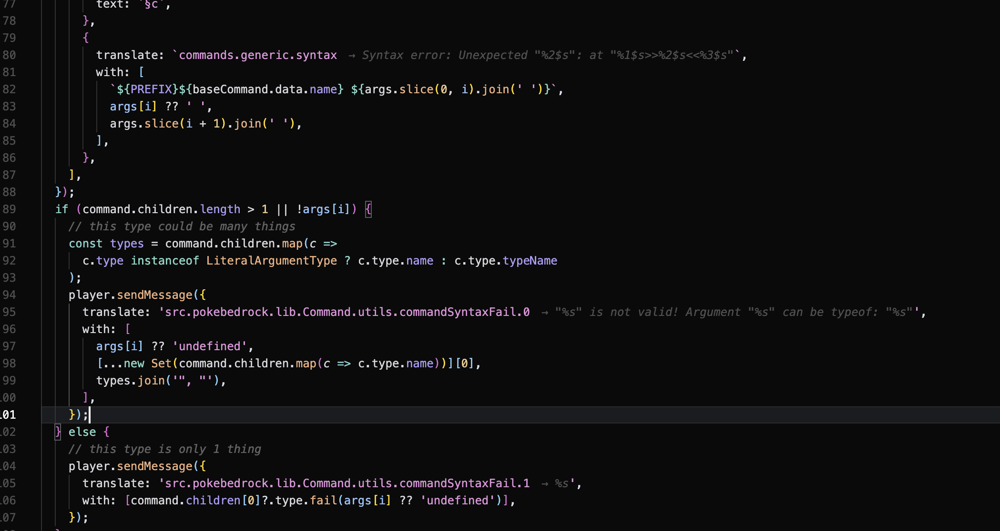

# MCBE Translate Viewer

A VS Code / Cursor extension that displays Minecraft Bedrock Edition translation strings inline in your code. Automatically detects resource packs in your workspace and shows the actual translated text for translate keys.



## Features

### 🔍 Inline Translation Preview
See translation values directly in your code as inline decorations:

```typescript
player.sendMessage({
  translate: 'src.pokebedrock.lib.Command.utils.commandSyntaxFail.0', // → Invalid argument "%s"...
});
```

### 🎯 Hover Information
Hover over any translate key to see:
- The full translation value
- Which language file it comes from
- The line number in the .lang file
- Quick link to jump to the definition

### ⚠️ Missing Translation Warnings
Keys without translations are highlighted so you can easily spot missing translations.

### 🌐 Multi-language Support
Switch between different language files (en_US, es_ES, de_DE, etc.) to preview translations in different languages.

### 📦 Vanilla Translations Built-in
Automatically includes vanilla Minecraft Bedrock Edition translations from the [official resource pack](https://github.com/ZtechNetwork/MCBVanillaResourcePack). Your resource pack translations override the vanilla defaults, giving you access to all base game translations out of the box.

## How It Works

1. **Resource Pack Detection**: The extension scans workspace folders for Minecraft Bedrock resource packs by looking for `manifest.json` files with a `"type": "resources"` module.

2. **Translation Loading**: When a resource pack is found, it loads the `.lang` files from the `texts/` directory.

3. **Key Detection**: The extension recognizes translate keys in patterns like:
   - `translate: 'key.name'`
   - `translate: "key.name"`
   - `{ "translate": "key.name" }`

4. **Display**: Translation values are shown as:
   - Inline decorations after the key
   - Hover tooltips with full details
   - Warning highlights for missing keys

## Configuration

Configure the extension in your VS Code settings (`.vscode/settings.json`):

```json
{
  // Default language file to use (default: "en_US")
  "mcbeTranslateViewer.defaultLanguage": "en_US",

  // Additional resource pack paths (useful for external resource packs)
  "mcbeTranslateViewer.resourcePackPaths": [
    "/path/to/my/resource-pack"
  ],

  // Show inline translation previews (default: true)
  "mcbeTranslateViewer.showInlineTranslations": true,

  // Maximum length of inline previews before truncating (default: 60)
  "mcbeTranslateViewer.inlineMaxLength": 60,

  // Highlight translate keys without translations (default: true)
  "mcbeTranslateViewer.highlightMissingTranslations": true,

  // Include vanilla MCBE translations as defaults (default: true)
  "mcbeTranslateViewer.useVanillaTranslations": true
}
```

## Commands

- **MCBE: Refresh Translations** - Manually refresh the translation cache
- **MCBE: Select Translation Language** - Switch between available languages
- **MCBE: Go to Translation Definition** - Jump to the translation in the .lang file
- **MCBE: Clear Vanilla Translations Cache** - Clear cached vanilla translations and re-fetch from GitHub

## Requirements

- VS Code 1.85.0 or higher
- A Minecraft Bedrock resource pack with `texts/*.lang` files in your workspace

## .lang File Format

The extension parses standard Minecraft Bedrock `.lang` files:

```
## This is a comment
pack.name=My Resource Pack
pack.description=Description of my pack
item.custom:my_item=My Custom Item
```

## Installation

### From Source

1. Clone this repository
2. Run `npm install` to install dependencies
3. Run `npm run compile` to build the extension
4. Press `F5` to launch a new VS Code window with the extension loaded

### From VSIX

1. Download the `.vsix` file
2. In VS Code, open the Command Palette (`Ctrl+Shift+P`)
3. Run "Extensions: Install from VSIX..."
4. Select the downloaded file

## Development

```bash
# Install dependencies
npm install

# Compile the extension
npm run compile

# Watch for changes during development
npm run watch

# Package the extension
npm run package
```

## License

MIT

